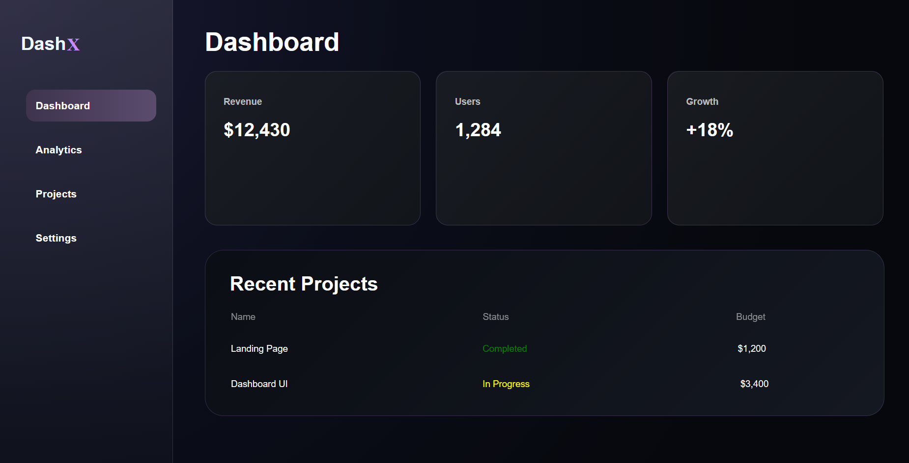

# Modern Dashboard UI

A modern and responsive dashboard interface built using HTML and CSS.

## Preview



## Features

- Modern dark theme
- Animated statistic cards
- Sidebar navigation
- Responsive layout
- Clean UI design
- Pure HTML & CSS
- Glassmorphism-inspired design

## Technologies Used

- HTML5
- CSS3
- Flexbox
- CSS Animations
- Gradients

## Project Structure

```
index.html
style.css
README.md
screenshots/
```

## Future Improvements

- Responsive mobile version
- JavaScript interactions
- Dark/Light mode switch
- Icons
- Charts

## Author

Hadi Hamze
